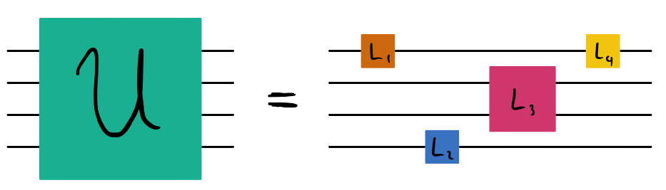

# Differentiable ZNE: Global circuit folding

In the "Explorer" level challenge, you looked at modelling noise in a quantum computer. Let's take an adventure into the realm of error-mitigation with the introduction of _global circuit folding_.

Error mitigation is the idea that we can bypass, or _mitigate_, errors that are present in real quantum hardware without actually doing anything to the hardware itself. Remember those bitflip errors you looked at? What if there was a way to get rid of them without _actually_ getting rid of them?

How can we do this in practice? With zero-noise extrapolation (ZNE)!

The ZNE protocol approaches error mitigation in a somewhat backwards way; instead of coming up with a way to reduce the error directly, we instead _increase_ the error and extrapolate _back_ to zero error. In other words, we want to create more noise in order to extrapolate less noise. So how do we create more noise?

One way to create more noise in a quantum circuit being run on real hardware is to increase the depth of the quantum circuit. Imagine I have some unitary $U$ that describes my quantum circuit. I still want my circuit to effectively be described by $U$, but what's to stop us from doing this: $U\rightarrow U \mathbb{I}^n = U (U^\dagger U)^n$? At the end of the day, the circuit is still doing the same thing, but we've increased the number of gates in the circuit $d$ to be $d\rightarrow d(2n+1)$. If programming each gate onto a real device imparts some noise, we've introduced more noise from this mapping!

We can generalize the mapping $U\rightarrow U (U^\dagger U)^n$ further by including _partial_ folds:

$$
U\rightarrow U (U^\dagger U)^n \rightarrow U (U^\dagger U)^n L^\dagger_d \cdots L^\dagger_s L_s \cdots L_d
$$

where $s\in [1, d]$ and $L_i$ denotes a quantum gate within $U$. Specifically, $U=L_1 L_2 \cdots L_s \cdots L_d$. In this challenge, you will implement a noisy circuit $U (U^\dagger U)^n L^\dagger_d \cdots L^\dagger_s L_s \cdots L_d$.

Challenge code
--------------

The provided code below contains several functions:

*   `U`: A quantum function that applies the gates in the circuit (i.e. all of the $L_i$'s):

*   `circuit`: A noisy circuit using $U$, where noise is placed on every gate (see `dev_noisy`). Here, the noise is described by a depolarizing channel.
*   `circuit_ops`: A function that returns all of the gates in `circuit`.
*   `global_fold_circuit`: A noisy circuit that implements the global circuit folding protocol: $U (U^\dagger U)^n L^\dagger_d \cdots L^\dagger_s L_s \cdots L_d$. **You must complete this function**.
*   `fidelity`: A function that calculates the fidelity between the output state from `circuit` (i.e. the original circuit) and the state from `global_fold_circuit`. Your `global_fold_circuit` function's validity will be assessed via the `fidelity` function.

### Input

As input to this problem, you will be given:

*   `angle`: a rotation angle needed to define `U`
*   `n`: the number of times $U^\dagger U$ gets implemented
*   `s`: the parameter that defines $L_s \cdots L_d$

Please note that `s` will be given as an integer $[1, d]$. Make sure to index properly!

### Output

This code will output the fidelity, a `float`, between the output state from `circuit` and the state from `global_fold_circuit`.

If your solution matches the correct one within the given tolerance specified in `check` (in this case it's a `1e-4` relative error tolerance), the output will be `"Correct!"`. Otherwise, you will receive a `"Wrong answer"` prompt.

Good luck!