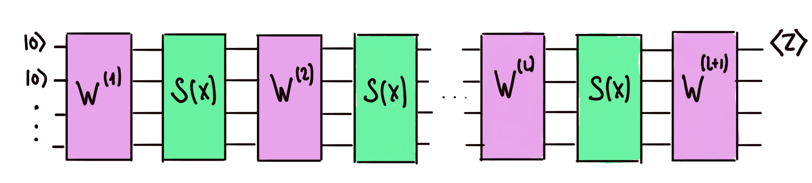
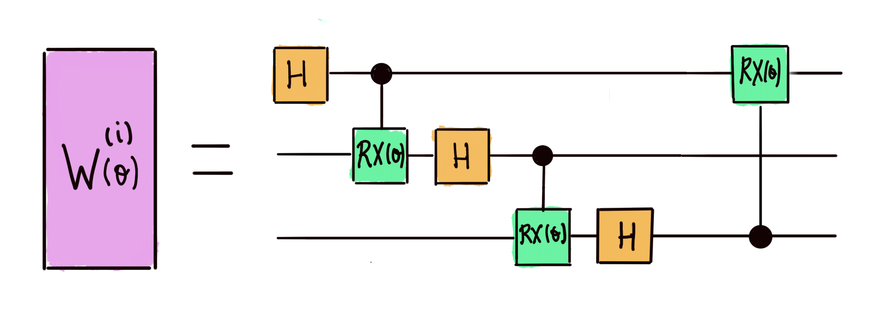
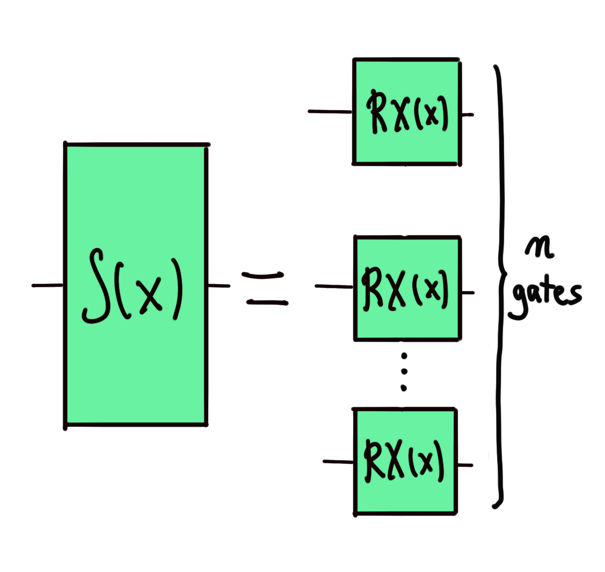
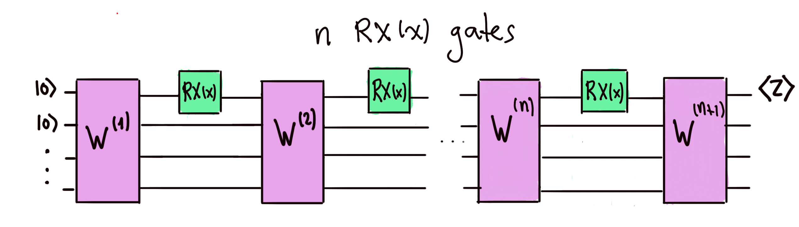

# Fourier spectrum of quantum models: Building a model

In this set of problems, we will learn how to calculate the [Fourier spectrum](https://en.wikipedia.org/wiki/Fourier_transform) of quantum circuits that encode classical data. As a first step, let's learn how to encode classical data using quantum circuits!

Functions taking classical input data can be evaluated by building quantum circuits and computing the expectation value of Hermitian operators. These circuits depend on additional parameters (other than the data), which means that they, in fact, model a family of functions.

In order to encode real-valued data and build a function that models it, we generally build a circuit that has the following structure.

The unitaries are known as the _trainable circuit blocks_, which depend on independent parameters . The are known as the _encoding circuit blocks,_ and depend on the classical input data , which is a real number.

In this challenge, we will work with a three-wire quantum circuit. We choose the to be the following one-parameter unitary.

Do keep in mind that each of the trainable blocks depends on the independent trainable parameters !

We will build two types of model. In the first one, the data is encoded in parallel. In this case, there are only two trainable blocks and and, given a _number of encoding gates_ , the encoding block is given by the following set of in-parallel X-rotations:

The second type of model encodes the data in series. In this case is only _one_ X-rotation acting on the first wire. Given the number of encoding gates _n_, the circuit takes the form:

Challenge code
--------------

You must complete the `quantum_model` function to build the in-series or in-parallel quantum circuit described above, as specified by an input string that takes the values "series" or "parallel". The function must then return the expectation value of the Pauli-Z operator on the first wire.

### Input

As input to this problem, you are given:

*   `n` (`int`): The number of enconding gates () used in our circuit, as explained above. To account for the parallel case, we assume it's always smaller than or equal to the number of wires.
*   `train_params` (`list(float)`): A list of length `n` + 1. In the in-series case, these are the parameters of the trainable blocks (the angles) from left to right. In the parallel case, since there are only two trainable blocks, only the first two elements of this list are used.
*   `x` (`float`): The input data, and also the rotation parameter in the encoding blocks.
*   `model_type` (`str`): A string that can take the value "series" or "parallel", depending on the type of encoding we choose.

### Output

This code will output a `float` corresponding to the expectation value of PauliZ measurements on the first wire of our quantum model.

If your solution matches the correct one within the given tolerance specified in `check` (in this case it's an absolute tolerance of `0.01`), the output will be `"Correct!"`. Otherwise, you will receive a `"Wrong answer"` prompt.

Good luck!