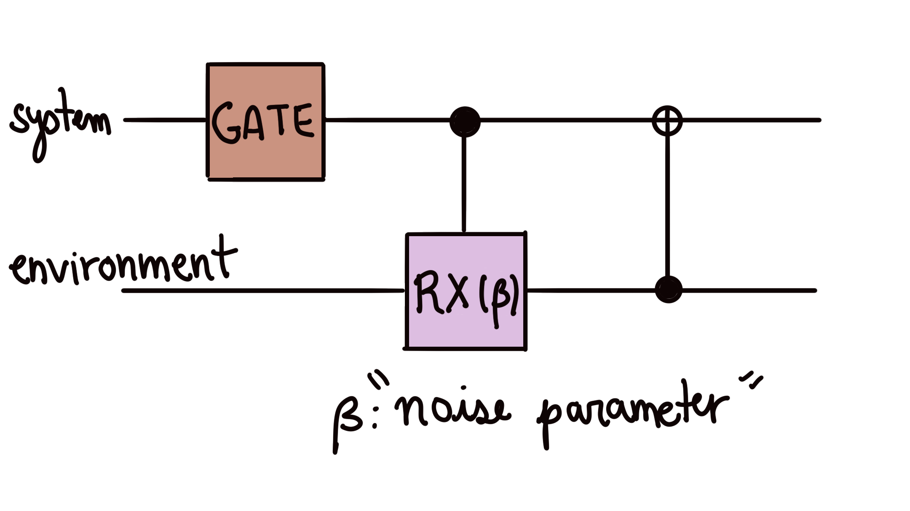
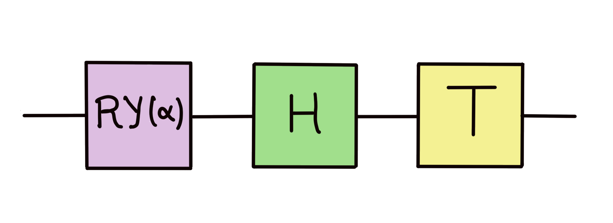

# Quantum transforms and noise: Energy dissipation

When we program quantum devices in PennyLane, we assume that gates work exactly as expected. This assumption is not entirely true. Gates are noisy: our qubit interacts with the quantum state of its surroundings and its state may change! For example, a qubit could dissipate energy into the environment.

Let us study a toy model of such a process. We model energy dissipation by gates in a **one-qubit circuit** by adding the following interaction with the environment **after every gate**.

Given the following one-qubit `circuit` with rotation parameter ,

your task is to create and apply the quantum transform `noise`, which depends on the noise parameter $\beta$, in order to add energy dissipation after each gate in `circuit`.

Our final objective is to **find the purity** $P=Tr(\rho^2)$ of the final state $\rho$ of the one-qubit system. The purity is a measure of how noisy our final state is. If it's close to 1, it means that the state was not affected by external noise.

Challenge code
--------------

You must complete the `state_purity` function to find the purity of the final state of the one-qubit system after dissipating energy. The system's initial state $\ket \psi$ is parametrized by a rotation _angle_ $\theta$ and a _phase_ $\phi$

$$
\ket \psi = \cos(\frac{\theta}{2}) \ket 0 + e^{i\phi} \sin(\frac{\theta}{2}) \ket 1
$$

The easiest way to solve this probem is to use `qml.transforms.insert` to apply your `noise` transformation to `circuit` to create the `noisy_circuit` QNode.

**Note:** Do not use `transforms` as decorators for this problem. They will yield different results due to how they work on the back-end. Use them within circuits instead.

Assume that the preparation of the initial state _does not_ dissipate energy.

### Input

As input to this problem, you are given:

*   `angle` (`float`): The angle $\theta$ parametrizing the initial state
*   `phase` (`float`): The phase angle $\phi$ parametrizing the initial state
*   `circuit_param` (`float`): The rotation angle $\alpha$ in the $RY$ gate in the `circuit` we add noise to.
*   `noise_param` (`float`): The rotation angle in the $\beta$ in the $CRX$ gate in our model for energy dissipation.

### Output

This code will output a `float` corresponding to the purity of the final state of the one-qubit system.

If your solution matches the correct one within the given tolerance specified in `check` (in this case it's an absolute tolerance of `0.01`), the output will be `"Correct!"`. Otherwise, you will receive a `"Wrong answer"` prompt.

Good luck!