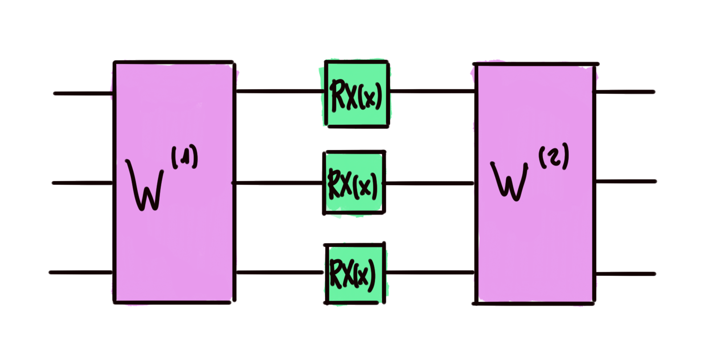
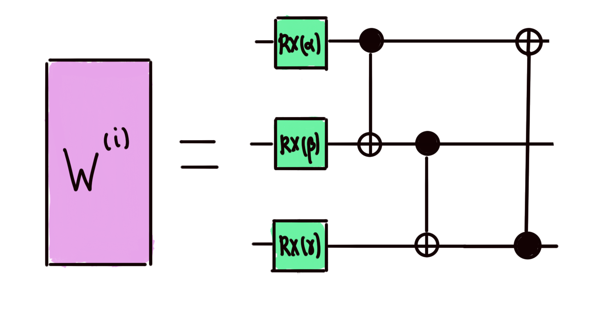

# Fourier spectrum of quantum models - Distance in Fourier space

Quantum models can be used to approximate real functions that take in one (or even several) real variables. But how good is this approximation? One way to measure the closeness of the approximate to the analytic function is by calculating the $\mathcal{l}^2$ distance in Fourier space, which we will define later. For the purposes of this challenge, we are interested in approximating a function $f:\mathbb{R}\rightarrow \mathbb{R}$ with discrete Fourier expansion

$$
f(x) = \sum_{\omega=-3}^3 c_\omega e^{i\omega x}
$$

where the $c_\omega$ are complex numbers knows as _Fourier coefficients_. We see that the function can be decomposed into sinusoidal waves of frequencies 0, 1, 2 or 3. An interesting result in quantum machine learning is that we can get such functions by using a model with an _in-parallel encoding block_ containing three $RX$ gates, one in each wire, as shown below:

where $x\in \mathbb{R}$ is the input data. Note that all rotation gates depend on the same $x$.

At the end, the expectation value of the Pauli-Z observable is calculated on the first wire. The _trainable circuit blocks_ $W^{(i)}$ depend on three parameters each, and correspond to a [_Basic Entangler_](https://docs.pennylane.ai/en/stable/code/api/pennylane.BasicEntanglerLayers.html?highlight=basicentangler#pennylane.BasicEntanglerLayers):

Let us denote the output $\langle Z \rangle$ of the quantum model by $g_\theta(x)$, where $\theta$ is the set of parameters in the trainable circuit blocks. This real function has a Fourier expansion

$$
g_\theta(x) = \sum_{\omega=-3}^3 b_\omega(\theta) e^{i\omega x}
$$

Then the **squared** $\mathcal{l}^2$ distance in Fourier space between $f$ and $g_\theta$ is given by

$$
d(f, g_\theta)^2 = \sum_{\omega=-3}^3 |c_\omega - b_\omega(\theta)|^2
$$

Your task is to calculate this **squared distance**, given the coefficients $c_\omega$ of the function $f$ and the parameters $\theta$ of the circuit.

To accomplish this, you will need to find the _Fourier coefficients_ of the quantum circuit. Check out PennyLane's Fourier module documentation to learn how!

Challenge code
--------------

You must complete the `fourier_squared_distance` function return the squared $\mathcal{l}^2$ distance in Fourier space between the target function and our quantum model evaluated on some parameters $\theta$.

### Input

As input to this problem, you will be given:

*   `list_of_coeffs` (list(np.complex)): List of seven elements representing the Fourier coefficients of $f$, in the conventional order $[c_0, c_1, c_2, c_3, c_{-3}, c_{-3}, c_{-1}]$.
*   `param_list` (list(float)): List of the six parameters characterizing each of the two Basic Entanglers in our circuit. The first three elements are the parameters in the first entangler, from the top to the bottom wire. The last three elements correspond to the second entangler, with a similar wire order.

### Output

This code will output the squared distance, `float`, which is the distance in Fourier space between the target function and our quantum model.

If your solution matches the correct one within the given tolerance specified in `check` (in this case it's an absolute tolerance of `0.01`), the output will be `"Correct!"`. Otherwise, you will receive a `"Wrong answer"` prompt.

Good luck!