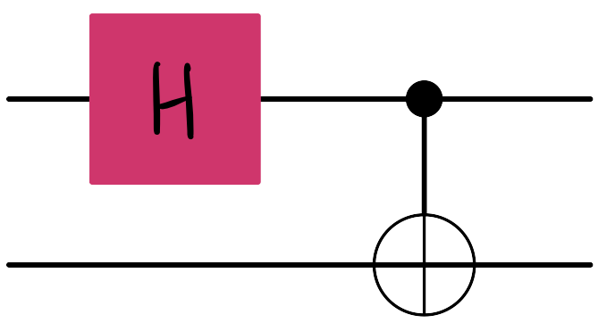
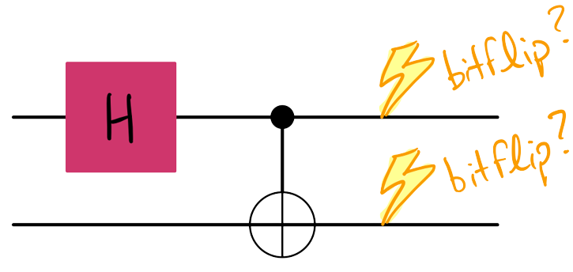

# Differentiable ZNE: Noisy circuits

Whenever we simulate quantum circuits, we can do so under the most ideal circumstances, i.e. without needing to worry about _noise_. In practice, implementing, say, a Pauli gate on today's hardware isn't as easy as writing `qml.PauliZ`; what ends up actually being implemented is an operation that's _close_ to `qml.PauliZ` because, in some way, real-world noise is present.

There are many ways to combat noise, including a technique called zero-noise extrapolation (ZNE). We will work more with ZNE later! But, on the path towards fault-tolerant quantum computing, we must inevitably understand noise in order to combat it.

PennyLane offers the ability to _simulate_ different types of noise that are present in quantum devices. One such type of noise is called a _bitflip_ error. A bitflip error, occuring with a probability on a given single qubit, is an error resulting in the state of a qubit being accidentally flipped. Check out [this demo](https://pennylane.ai/qml/demos/tutorial_noisy_circuits.html#noisy-operations) to learn more about modelling noise in PennyLane!

In this challenge, you'll implement a two-qubit circuit that contains bitflip errors on each of the qubits to see how the resulting quantum state drifts from that of the noise-less/error-free circuit. To do so, the [fidelity](https://docs.pennylane.ai/en/stable/code/api/pennylane.math.fidelity.html?highlight=fidelity) between the respective states for various bitflip probabilities will be calculated.

Challenge code
--------------

The provided code below contains a few functions:

*   `circuit`: A quantum circuit that contains a Hadamard and CNOT gate.

*   `bitflip_circuit`: A quantum circuit that must be exactly like `circuit`, with the exception of bitflip errors on each qubit. **You must complete this function**.

*   `fidelities`: This function returns the quantum fidelity between the resulting states from the circuits mentioned above for various bitflip probabilities.

### Input

As input to this problem, you are given a list of probabilities (`list(float)`) that define bitflip probabilities.

### Output

This code will output the `fidelities` (`list(float)`) between the error-free circuit's state and that of the circuits with bitflip errors given by the input probabilities.

If your solution matches the correct one within the given tolerance specified in `check` (in this case it's a `1e-4` relative error tolerance), the output will be `"Correct!"`. Otherwise, you will receive a `"Wrong answer"` prompt.

Good luck!

### Code

Read the challenge description above and begin writing your solution using the code blocks below. You can only edit codeblocks that have a grey background. When you are ready, click "Submit" to check if your solution is correct! Users who navigate with their keyboard or screen reader software can escape editable code blocks by pressing esc followed by tab.

This challenge contains hidden test cases that will be used to test your solution.
