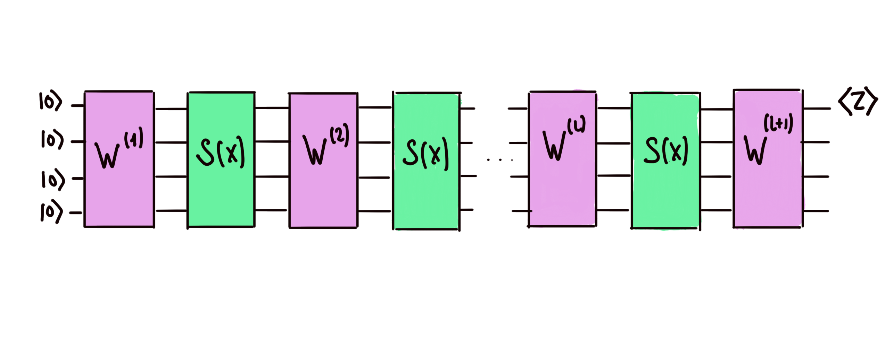
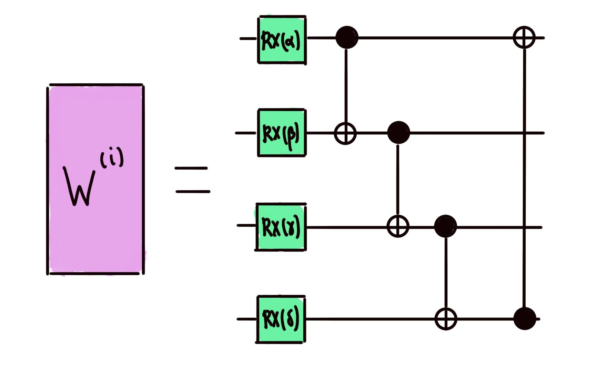
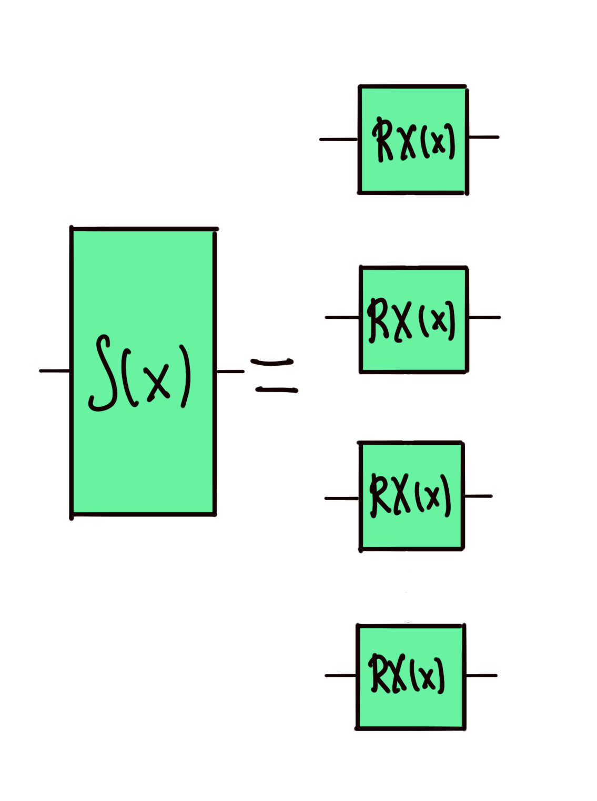

# Fourier spectrum of quantum models - Coefficients and frequencies

In this problem, we will extract the Fourier coefficients and frequencies of a particular quantum model using PennyLane's [Fourier Module](https://docs.pennylane.ai/en/stable/code/qml_fourier.html). The quantum model, which uses **four qubits** is the following:

Note that the output is the expectation value of the Pauli-Z observable on the first wire.

The _trainable circuit blocks_ $W^{(i)}$ correspond to a number of _Basic Entangler Layers_:

This number of entangler layers need not be the same in every block! Each $W^{(i)}$ could be a concatenation of a different number of these.

The _encoding circuit blocks_ $S$ depend on the input data $x$ and we will take them to be a set of four parallel $RX$ gates (one in each wire), whose parameters are all the input data $x$.

Your task is to find the Fourier frequencies allowed by this quantum model and the Fourier coefficients associated to each of these frequencies. Be mindful that these quantities do not depend on the input data!

Challenge code
--------------

You must complete the `fourier_decomp` function to return a list with the Fourier frequencies and the real and imaginary parts of the Fourier coefficient associated with these frequencies.

The input `layers_params` of `fourier_decomp` specifies how many trainable circuit blocks we have in our circuit, how many basic entangler layers each block contains, and what are the parameters in the rotation within the entangler layers. The elements of the list `layers_params` are lists of lists of real numbers. The $i$-th element of `layers_params` corresponds to the $i$-th trainable circuit block. If this element is of length $j$ (i.e. it contains $j$ lists of numbers), it means that the $i$-th trainable circuit block contains $j$ basic entangler layers. Each of these $j$ lists of numbers contains 4 real numbers, corresponding to the parameters in the `RX` gates within the entangler layers.

For example, `layers_params` = [[[0.1,0.3,0.4,0.5],[1.0,0.6,0.7,0.8]],[1.3,1.5,0.8,0.9]]] gives us the circuit:

Check the [documentation](https://docs.pennylane.ai/en/stable/code/api/pennylane.BasicEntanglerLayers.html) of `qml.BasicEntanglerLayers` to see how this seemingly confusing way to encode the trainable parameters actually makes your life easier!

### Input

As input to this problem, you are given `layers_params` (`list(list(list(float))`), which is explained above.

### Output

This code will output a `list(list(float))`. Each element of the `list` is a `list` containing the frequency, the real value of the coefficient associated with that frequency, and the imaginary value of the coefficient, in that order. For example, the output will look like `[[freq1, real1, imag1], [freq2, real2, imag2], [freq3, real3, imag3]]`.

Frequencies must be ordered from most negative to most positive. Do keep in mind that the ordering of the Fourier coefficients when using the [Fourier module's](https://docs.pennylane.ai/en/stable/code/qml_fourier.html) `qml.fourier.coefficients` is, for example, $[c_0, c_1, c_2, c_3, c_4, c_{-4}, c_{-3}, c_{-2}, c_{-1}]$ (for 4 frequencies, but there may be more), where the subscripts represent the frequencies, so you may have some reordering to do!

If your solution matches the correct one within the given tolerance specified in `check` (in this case it's a `0.01` absolute tolerance), the output will be `"Correct!"`. Otherwise, you will receive a `"Wrong answer"` prompt.

Good luck!