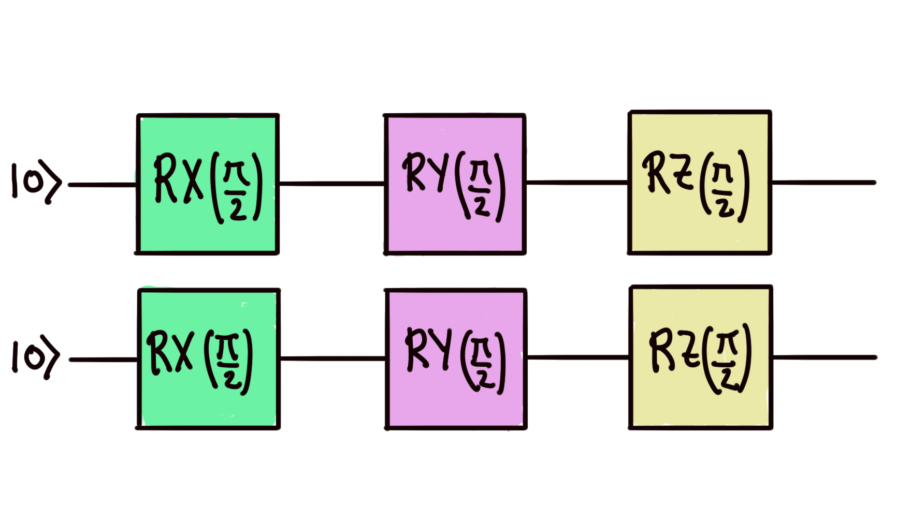
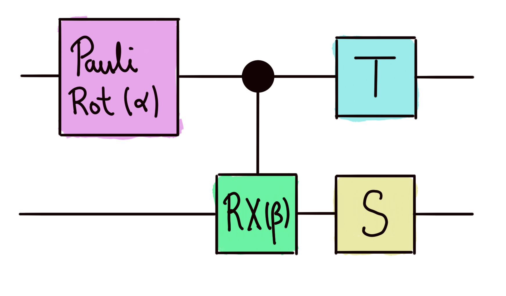

# Quantum transforms and noise: Maximizing fidelity

Sometimes implementing a quantum gate in a particular device may come at a certain cost. But what if I can produce the quantum state that I want in another way? Or get a similar enough circuit via a different implementation? In this problem, we study the extent to which a circuit with **only single-qubit rotation gates** can produce a state that is close to some state produced by some _target circuit_. This target circuit even contains two-qubit gates!

We are given the following _available circuit_

which contains only Pauli rotations by an angle of $\pi/2$. Your first task will be to **use a quantum transform**, already built for you, to make the rotations dependent on six independent parameters. You will then write an optimization routine to find the parameters that **maximize the fidelity** between the above circuit and the _target circuit_ below,

which depends on a rotation parameter and a controlled-rotation parameter $\beta$. The rotation at the beginning of the circuit can be a Pauli X, Y, or Z rotation.

Challenge code
--------------

You must complete the `optimal_fidelity` function to find the maximal fidelity between the 2-qubit output states of the transformed available circuit (after adding independent rotation parameters), and the target circuit.

The quantum transform `rotate_rots` rotates each rotation gate in the available circuit `circuit()` by an independent parameter. Use it to your advantage!

### Input

As input to this problem, you are given:

*   `target_params` (`list(float)`): A list of the two angles $\alpha$ and $\beta$ representing the parameters of the target circuit.
*   `pauli_word` (`str`): A string that can be "X", "Y" or "Z", specifying the initial rotation of the target circuit.

### Output

This code will output a `float` corresponding to the maximal fidelity between the output states of both circuits.

If your solution matches the correct one within the given tolerance specified in `check` (in this case it's an absolute tolerance of `0.01`), the output will be `"Correct!"`. Otherwise, you will receive a `"Wrong answer"` prompt.

Good luck!